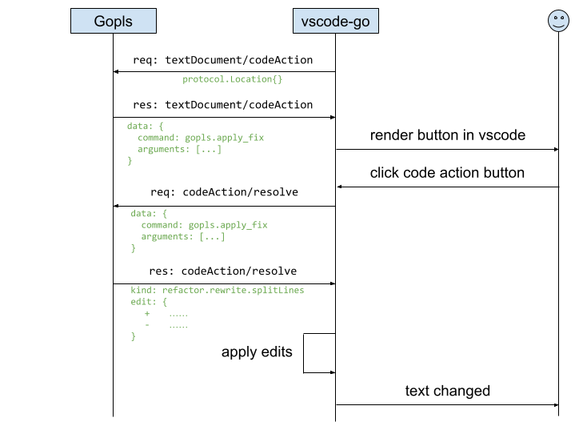
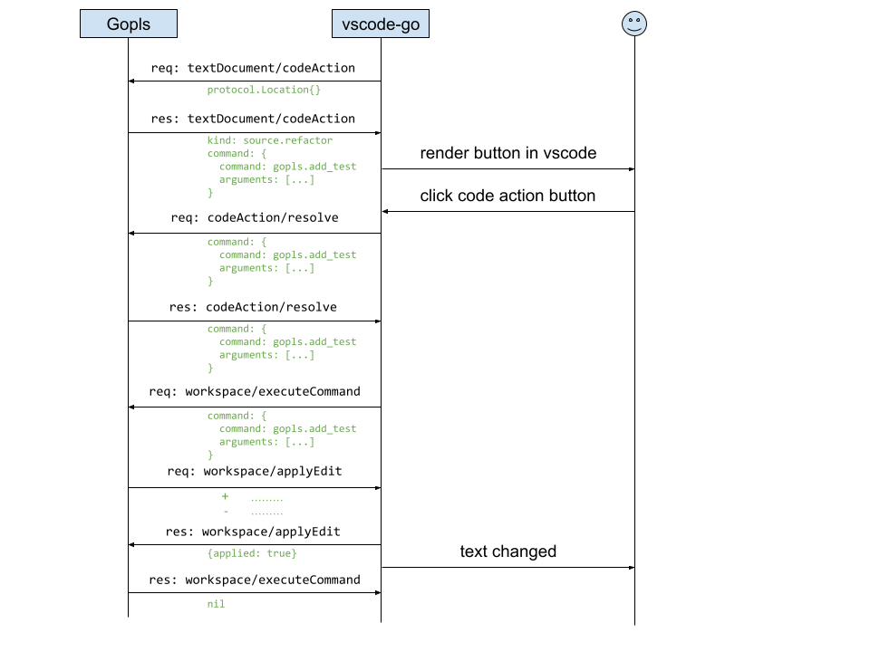
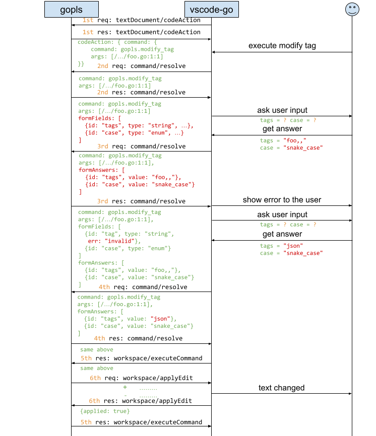
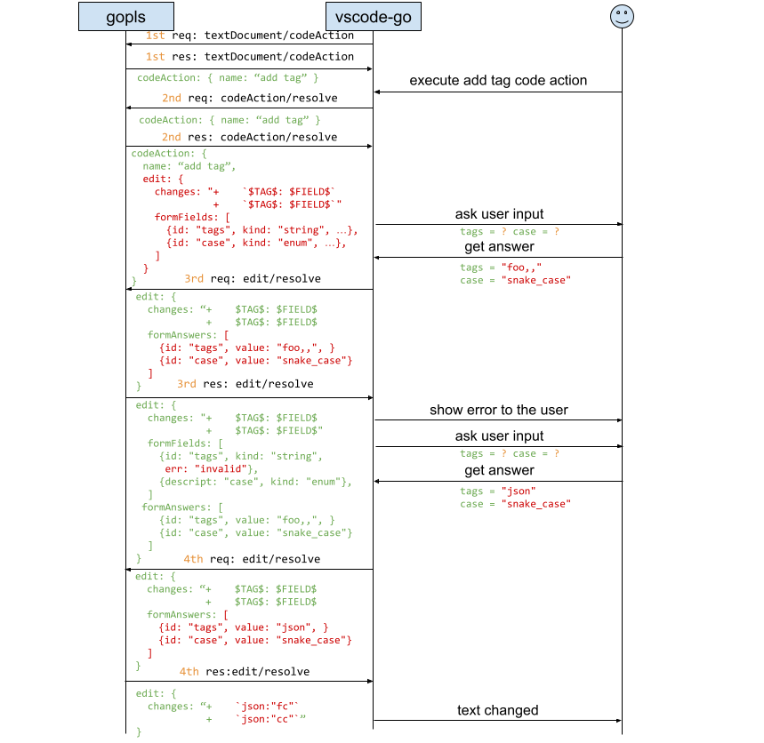
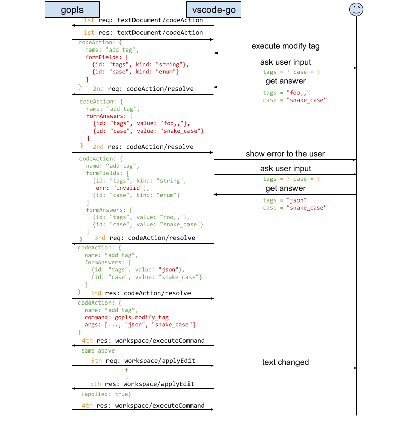
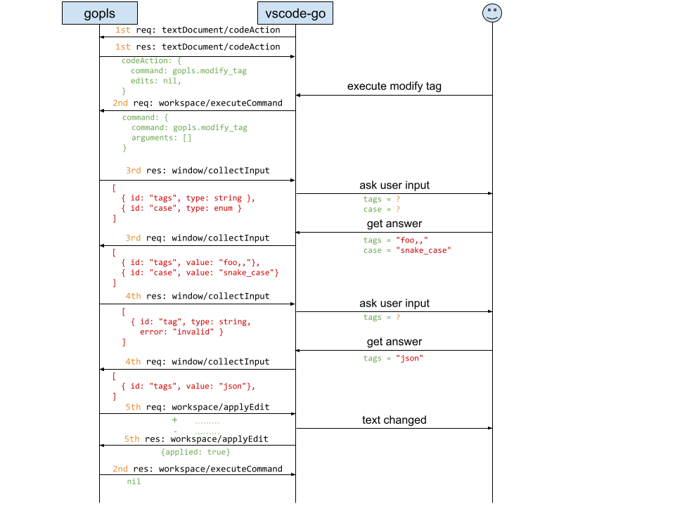

# Proposal: Language Server Protocol (LSP) Interactive Code Actions

Author(s): Hongxiang Jiang (hxjiang@golang.org)

Thanks to: Alan Donovan, Brian Wilkerson, Danny Tuppeny, Hana Kim, Madeline Kalil, Peter Weinberger, Robert Findley.

Last updated: 16 July 2026

## Abstract

This proposal outlines systematic and scalable approaches for the Language Server Protocol (LSP) to support refactoring operations that require user input. Current LSP refactoring is limited to operations that do not require user input (with the exception of renaming).

## Background

The teams working on the Go and Dart programming languages have received a number of feature requests that require user input to implement:
- [golang/go#57016](https://go.dev/issue/57016): support move type refactoring.
- [golang/go#70583](https://go.dev/issue/70583): support move declaration refactoring.
- [golang/go#38028](https://go.dev/issue/38028): support change signature refactoring.
- [golang/vscode-go#2002](https://github.com/golang/vscode-go/issues/2002): migrate gomodifytags require input from users.
- [golang/vscode-go#1547](https://github.com/golang/vscode-go/issues/1547): add package/interface drop downs to stub methods.
- [Dart-code/Dart-code#1831](https://github.com/Dart-Code/Dart-Code/issues/1831): support move widget/class refactoring.

We have researched the prior art mostly from Dart (see below) and propose a few systematic and scalable approaches for the LSP spec.

*   **Move to File**: [Dart Code Releases - Move to File](https://dartcode.org/releases/#experimental-refactors-move-to-file)
*   **Extract Widget**: [Dart Code Releases - Extract Widget](https://dartcode.org/releases/#extract-widget-refactor)

## Goal

The primary goal of these proposals is to support interactive workflows in LSP, establishing a backward-compatible mechanism for language servers to collect user input, primarily for code transformations, as well as non-edit server operations.

This design centralizes the workflow logic within the language server while delegating UI rendering entirely to the client. We recommend the [Command layer proposal](#approach-2-command-layer-recommended) as our primary path, which we have successfully validated in production with releases in [gopls v0.23.0](https://github.com/golang/tools/releases/tag/gopls%2Fv0.23.0) and [vscode-go v0.56.0](https://github.com/golang/vscode-go/releases/tag/v0.56.0).

## Common Data Types

We propose a common interface, `InteractiveParams`, because this data structure is used in multiple places across the proposals below. This interface introduces the core concepts of "questions" and "answers".

A key component of the design is that the communication mechanism between the language client and the server should be stateless, modeled after stateless HTML/HTTP form submissions. Imagine going to the DMV to submit an application: you fill in a form full of questions. The officer sees a missing answer and asks you to go back, fill that in, and come back, not necessarily to the same officer. When you come back to the counter, you bring the **entire form** instead of only the missing answer.

As a result, the language server evaluates the form and may:
*   Ask the language client to re-fill the form because the answer is partially filled or wrongly filled.
*   Move on to execution because all the answers are correctly filled in.

In a design based on server-to-client requests (reversing the client-to-server flow above), the language server must keep an active RPC open and hold resources while waiting for user input (analogous to a DMV teller standing idle at the counter while the customer fills out a form). By contrast, this stateless approach provides three main benefits:
*   **Persistence across restarts**: The language client can return to any language server instance (even after a server process restart).
*   **Unblocked server resources**: The language server is not tied up holding snapshots for static analysis or blocked threads, leaving it free to serve other requests.
*   **No RPC timeouts**: The server imposes no maximum RPC duration on the language client filling out the form.

Depending on UI capabilities, clients can either render the entire form at once or prompt questions sequentially. For sequential clients, we recommend only presenting fields that are missing valid answers (i.e., where the field's ID is not in `formAnswers` or has an explicit validation `error`) to avoid repetitive prompts. Since the protocol is stateless, the server can control question dependencies or revoke a previously answered question simply by omitting its answer from `formAnswers` or marking it with an error in the validation response, signaling the client to ask it again.

```typescript
export interface InteractiveParams {
	// FormFields defines the questions and validation errors in previous
	// answers to the same questions.
	//
	// This is a server-to-client field. The language server defines these, and
	// the client uses them to render the form.
	//
	// The interactive phase is considered complete when the server returns a
	// response where this slice is omitted.
	formFields?: FormField[];

	// FormAnswers contains the answers for the form questions.
	//
	// When sent by the language server, this field is optional and contains the
	// user's previous answers from prior resolution steps to support editing
	// previously entered values.
	//
	// When sent by the language client, this field contains the user's answers.
	// Answers are linked to their respective questions using the field's unique
	// `id` rather than their array index. The list must not contain duplicate IDs,
	// and each answer's ID must correspond to a field ID defined in `formFields`.
	//
	// The client must include answers for all required fields (where `required`
	// is true). Answers for optional fields (where `required` is false)
	// may be omitted if no answer was provided, or included if an answer is available.
	formAnswers?: FormAnswer[];
}

// FormField describes a single question in a form and its validation state.
export interface FormField {
	// ID is a unique identifier for this field. This key is used as the property
	// name in FormAnswers to map the user's input back to this specific field.
	id: string;

	// Description is the text content of the question (the prompt) presented to the user.
	description: string;

	// Type specifies the data type and validation constraints for the answer.
	type: FormFieldType;

	// Required specifies whether an answer is absolutely required for this field.
	required: boolean;

	// Default specifies an optional initial value for the answer.
	// If Type is FormFieldTypeEnum, this value must be present in the enum's values array.
	default?: any;

	// Error provides a validation message from the language server.
	// If empty or undefined, the current answer is considered valid.
	error?: string;
}

// FormAnswer describes a single answer to a FormField, identified by its unique
// ID.
export interface FormAnswer {
	// The ID of the FormField being answered.
	id: string;

	// The user's answer value.
	value: any;
}
```

The typical question types include:
- **`string`**: A simple text value.
- **`bool`**: A boolean value.
- **`file`**: A valid Document URI with filters on preexistence and file type
- **`number`**: A numeric value.
- **`enum`**: A selection from a pre-defined set of options.
- **`lazy enum`**: A selection from a dynamic or large set of options queried on demand and reactive to partial user input.
- **`list`**: A homogenous list of items.

<details>
<summary>View Form Field Type Definitions</summary>

``` typescript
// FormFieldKind defines the set of supported input type.
export type FormFieldKind = 'string' | 'file' | 'bool' | 'number' | 'enum' | 'lazyEnum' | 'list';

// FormFieldType acts as a Discriminated Union based on the 'kind' property.
export type FormFieldType =
	| FormFieldTypeString
	| FormFieldTypeFile
	| FormFieldTypeBool
	| FormFieldTypeNumber
	| FormFieldTypeEnum
	| FormFieldTypeLazyEnum
	| FormFieldTypeList;

// FormFieldTypeString defines a text input.
export interface FormFieldTypeString {
	kind: 'string';
}

// FileExistence represents whether the file denoted by a DocumentURI exists.
//
// It is a bit set allowing combinations of existence states. For
// example, New|Existing allows either state.
export enum FileExistence {
	// New indicates that file has not yet been created.
	New = 1 << 0,
	// Existing indicates that the file exists already.
	Existing = 1 << 1
}

// FileType represents the expected filesystem resource type.
//
// It is a bit set allowing combinations of file types. For example, Regular|Directory
// allows either types.
export enum FileType {
	// Regular indicates the resource could be a regular file.
	Regular = 1 << 0,
	// Directory indicates the resource could be a directory.
	Directory = 1 << 1
}

// FormFieldTypeFile defines an input for a file or directory URI.
//
// The client determines the best mechanism to collect this information from
// the user (e.g., a graphical file picker, a text input with autocomplete, etc).
//
// The value returned by the client must be a valid "DocumentUri" as defined
// in the LSP specification:
// https://microsoft.github.io/language-server-protocol/specifications/lsp/3.17/specification/#documentUri
export interface FormFieldTypeFile {
	kind: 'file';

	// Existence constraint.
	//
	// If omitted, allows both `New` and `Existing` files.
	existence?: FileExistence;

	// The expected file type (e.g., regular file or directory).
	//
	// If omitted, defaults to `Regular`.
	type?: FileType;

	// Filters specifies the allowed file extensions without the leading dot. A file
	// is valid if it matches any of the extensions (OR logic). e.g. ["png", "jpg"].
	//
	// If omitted or empty, no extension filter is applied.
	filters?: string[];
}

// FormFieldTypeBool defines a boolean input.
export interface FormFieldTypeBool {
	kind: 'bool';
}

// FormFieldTypeNumber defines a numeric input.
export interface FormFieldTypeNumber {
	kind: 'number';
}

// FormEnumEntry represents a single option in an enumeration.
export interface FormEnumEntry {
	// Value is the unique string identifier for this option.
	//
	// This is the value that will be sent back to the server in
	// 'FormAnswers' if the user selects this option.
	value: string;

	// Description is the human-readable label presented to the user.
	description: string;
}

// FormFieldTypeEnum defines a selection from a set of values.
//
// Use this type when:
// - The number of options is small (e.g., < 20).
// - All options are known at the time the form is created.
export interface FormFieldTypeEnum {
	kind: 'enum';

	// Name is an optional identifier for the enum type.
	name?: string;

	// Entries is the list of allowable options.
	entries: FormEnumEntry[];
}

// FormFieldTypeLazyEnum defines a selection from a large or dynamic enum entry set.
//
// Use this type when:
//  1. The dataset is too large to send efficiently in a single payload
//     (e.g., thousands of workspace symbols, file uri or cloud resources).
//  2. The available options depend on the user's input (e.g., semantic search).
//  3. Generating the list is expensive and should only be done if requested.
//
// The client is expected to render a search interface (e.g., a combo box with
// a text input) and query the server via 'interactive/listEnum' as the user types.
export interface FormFieldTypeLazyEnum {
	kind: 'lazyEnum';

	// Source identifies the data source on the server.
	//
	// Examples: "workspace/symbol", "database/schema", "git/tags".
	source: string;

	// Config contains the static settings for the source.
	// The client treats this as opaque data and echoes it back in the
	// 'interactive/listEnum' request.
	config?: any;
}

// FormFieldTypeList defines a homogenous list of items.
export interface FormFieldTypeList {
	kind: 'list';

	// ElementType specifies the type of the items in the list.
	// Recursive reference to the union type.
	elementType: FormFieldType;
}
```

</details>

## LSP Proposals

### Background: How Code Actions Work

Before discussing the proposals, it is important to understand the context of how code actions work today because most code transformations are done through code actions.

Today, there are primarily two kinds of code actions:
1. Code actions that eventually [resolve](https://microsoft.github.io/language-server-protocol/specifications/lsp/3.18/specification/#codeAction_resolve) to a code action with edits ([`workspaceEdit`](https://microsoft.github.io/language-server-protocol/specifications/lsp/3.17/specification/#workspaceEdit)): The client applies the edits directly to the user's workspace.



2. Code actions that eventually resolve to a code action with a command ([`command`](https://microsoft.github.io/language-server-protocol/specifications/lsp/3.18/specification#command)): The client instructs the server to execute the command, which may have a possible side effect of making a server-to-client `workspace/applyEdit` request.



(There is a third kind that resolves to both edits and a command, but it is just a combination of the first two.)

If we want to make code transformations interactive, we can introduce the "interactive" behavior (the back and forth communication) at different layers:
- For the first kind, we can introduce it at the **Code Action layer** or the **Edit layer**.
- For the second kind, we have three layers involved: **Code Action layer**, **Command layer**, and **Edit layer**.

The sections below detail our primary recommendation (Command layer), followed by alternative protocol layers (WorkspaceEdit, CodeAction, and Server-to-Client requests) for comparison.

### Approach 1: Command layer (recommended, prototype)

This approach introduces interactivity prior to command execution, parameterizing arguments via a stateless `command/resolve` loop.

The `command/resolve` request is sent from the client to the server to check whether a command is ready for execution or requires additional user input. Before executing any command that supports interactive resolution, the client must call `command/resolve` at least once to determine if the command arguments are comprehensive. As long as the `ExecuteCommandParams` contains non-empty `formFields` (questions), the client should not execute the command. Instead, the client should collect the user's answers and call `command/resolve` with the answers populated in `formAnswers`.

The server processes the answers and may return a new `ExecuteCommandParams` with new questions or validation errors, requiring further interaction. This process can repeat for multiple rounds. The interactive phase is considered complete when the server returns a response where `formFields` is omitted or empty, signaling that the command is ready to be executed via `workspace/executeCommand` including the answers in `formAnswers`.

**Client Capability:**
* property path (optional): `workspace.interactiveResolve`
* property type: `InteractiveResolveClientCapabilities`

```typescript
export interface InteractiveResolveClientCapabilities {
	/**
	 * The input types the client supports for interactive dialogs.
	 * The presence of this field implies support for interactive refactoring.
	 */
	inputTypes?: FormFieldKind[];
}
```

**Server Capability:**
* property path (optional): `interactiveResolveProvider`

```typescript
export interface interactiveResolveOptions {
	/**
	 * The kinds of interactive resolutions that the server supports.
	 *
	 * For example, "command" indicates that the server supports resolving
	 * `ExecuteCommandParams` interactively through "command/resolve".
	 */
	kinds?: string[];
}
```

**Request:**
* method: `command/resolve`
* params: `ExecuteCommandParams`

```typescript
export interface ExecuteCommandParams extends InteractiveParams {
  // ... original fields ...
}
```

**Response:**
* result: `ExecuteCommandParams`



**Example:**
Suppose the server returns a Code Action with a command to modify tags:
```text
CodeAction:
	command:
		command: gopls.modify_tags
		args: [...]
```

When the user clicks the action, the client calls `command/resolve` for the first time to ask if the command is comprehensive:
```text
ExecuteCommandParams:
	command: gopls.modify_tags
	args: [...]
```

The server returns questions in `formFields` because the command arguments are not comprehensive:
```text
ExecuteCommandParams:
	command: gopls.modify_tags
	args: [...]
	formFields: [
		{id: "tags", description: "tags to add", kind: string, required: true},
		{id: "case", description: "case to use", kind: enum, required: true}
	]
```

The client collects the user input `"foo,,"` and `"snake_case"` then calls `command/resolve` again to validate:
```text
ExecuteCommandParams:
	command: gopls.modify_tags
	args: [...]
	formAnswers: [
		{id: "tags", value: "foo,,"},
		{id: "case", value: "snake_case"}
	]
```

The server return questions with error:
```text
ExecuteCommandParams:
	command: gopls.modify_tags
	args: [...]
	formFields: [
		{id: "tags", description: "tags to add", kind: string, required: true, err: "invalid"},
		{id: "case", description: "case to use", kind: enum, required: true}
	]
	formAnswers: [
		{id: "tags", value: "foo,,"},
		{id: "case", value: "snake_case"}
	]
```

The client again collects user input and calls `command/resolve` with the new answers.
```text
ExecuteCommandParams:
	command: gopls.modify_tags
	args: [...]
	formAnswers: [
		{id: "tags", value: "json"},
		{id: "case", value: "snake_case"}
	]
```

The server returns a result without `formFields`, indicating the answer is validated:
```text
ExecuteCommandParams:
	command: gopls.modify_tags
	args: [...]
	formAnswers: [
		{id: "tags", value: "json"},
		{id: "case", value: "snake_case"}
	]
```

Finally, the client calls `workspace/executeCommand`:
```text
ExecuteCommandParams:
	command: gopls.modify_tags
	args: [...]
	formAnswers: [
		{id: "tags", value: "json"},
		{id: "case", value: "snake_case"}
	]
```

**Pros:**
* **Generalizes beyond edits**: Adding forms at the level of Commands, in contrast to the CodeAction- or WorkspaceEdit-based approaches described below, enables a greater variety of potential uses, including edits, but not limited to them. Commands may also run builds, execute tests, launch analysis tools (`govulncheck`), navigate the cursor, display web-based reports, and so on. Language servers are treated as execution hosts, not just code text manipulators.
* **Safe explicit triggering**: Resolution only fires when the user explicitly triggers an operation (e.g., clicking a code action), completely avoiding issues with [eager language clients](https://github.com/microsoft/vscode/issues/106410#issuecomment-690610121) that resolve actions automatically upon hover.
* **Applicable to other LSP requests**: Establishes a clean `<method>/resolve` pattern that can be extended to other LSP requests. For example, although Rename (unique among LSP requests) already supports a limited form of interactivity (`prepareRename`) to retrieve a target symbol's placeholder, complex renaming operations may wish to ask additional questions, such as how it should handle certain kinds of conflict. Before executing a rename, the client could call `rename/resolve` to resolve a `RenameParams` extending `InteractiveParams`.

**Cons:**
* **No support for edit-based CodeActions**: Interactivity is not supported for CodeActions that resolve directly to text edits (`WorkspaceEdit`). To use interactive forms, language servers must express the CodeAction using a `Command` payload instead.


### Approach 2: WorkspaceEdit layer (alternative)

An alternative to parameterizing commands prior to execution is to introduce interactivity at the `WorkspaceEdit` layer via `workspaceEdit/resolve` when edits are applied to the workspace.

We do not recommend this approach as it requires server-to-client `workspace/applyEdit` requests that block indefinitely while the client fills out the form, tying up server resources and incurring client RPC timeouts. Nonetheless, we detail it here because it provides a unified mechanism for text edit resolution across LSP methods and directly supports CodeActions that resolve to edits.

The `workspaceEdit/resolve` request is sent from the client to the server to resolve the final edits that should be applied to the workspace. As long as the `WorkspaceEdit` contains non-empty `formFields` (questions), the client should not apply the edits. Instead, the client should collect the user's answers and call `workspaceEdit/resolve` with the answers populated in `formAnswers`.

The server processes the answers and may return a new `WorkspaceEdit` with new questions or validation errors, requiring further interaction. This process can repeat for multiple rounds. The interactive phase is considered complete when the server returns a `WorkspaceEdit` where `formFields` is omitted or empty, signaling that the edits are finalized and ready to be applied to the workspace.

**Client Capability:**
* property path (optional): `workspace.workspaceEdit`
* property type: `WorkspaceEditClientCapabilities`

```typescript
export interface WorkspaceEditClientCapabilities {
	/**
	 * The input types the client supports for interactive dialogs.
	 * The presence of this field implies support for interactive refactoring.
	 */
	interactiveResolveInputTypes?: FormFieldKind[];
}
```

**Server Capability:**
* property path (optional): `workspace.workspaceEdit`

```typescript
export interface WorkspaceEditServerCapabilities {
	/**
	 * The server provides support to resolve WorkspaceEdits interactively.
	 */
	interactiveResolveProvider?: boolean;
}
```

**Request:**
* method: `workspaceEdit/resolve`
* params: `WorkspaceEdit`

```typescript
interface WorkspaceEdit extends InteractiveParams {
  // ... original fields ...
}
```

**Response:**
* result: `WorkspaceEdit`
* error: code and message set in case an exception happens during the request.



**Example:**
Imagine the original edit returned by the server is:
```text
WorkspaceEdit:
	changes:
	--- a/foo.go
	+++ b/foo.go
	type Foo struct {
	-       FC string
	-       CC string
	+       FC string `$TAG$:"$FIELD$"`
	+       CC string `$TAG$:"$FIELD$"`
	}
	formFields: [
		{id: "tags", description: "tags to add", kind: string, required: true},
		{id: "case", description: "case to use", kind: enum, required: true}
	]
```

The client collects the user input `"foo,,"` and `"snake_case"` then calls `workspaceEdit/resolve` with the answers:
```text
WorkspaceEdit:
	changes:
	--- a/foo.go
	+++ b/foo.go
	type Foo struct {
	-       FC string
	-       CC string
	+       FC string `$TAG$:"$FIELD$"`
	+       CC string `$TAG$:"$FIELD$"`
	}
	formAnswers: [
		{id: "tags", value: "foo,,"},
		{id: "case", value: "snake_case"}
	]
```

The server return questions with error:
```text
WorkspaceEdit:
	changes:
	--- a/foo.go
	+++ b/foo.go
	type Foo struct {
	-       FC string
	-       CC string
	+       FC string `$TAG$:"$FIELD$"`
	+       CC string `$TAG$:"$FIELD$"`
	}
	formFields: [
		{id: "tags", description: "tags to add", kind: string, required: true, err: "invalid"},
		{id: "case", description: "case to use", kind: enum, required: true}
	]
	formAnswers: [
		{id: "tags", value: "foo,,"},
		{id: "case", value: "snake_case"}
	]
```

The client again collects user input and calls `workspaceEdit/resolve` with the new answers.
```text
WorkspaceEdit:
	changes:
	--- a/foo.go
	+++ b/foo.go
	type Foo struct {
	-       FC string
	-       CC string
	+       FC string `$TAG$:"$FIELD$"`
	+       CC string `$TAG$:"$FIELD$"`
	}
	formAnswers: [
		{id: "tags", value: "json"},
		{id: "case", value: "snake_case"}
	]
```

The server returns the finalized workspace edit:
```text
WorkspaceEdit:
	changes:
	--- a/foo.go
	+++ b/foo.go
	type Foo struct {
	-       FC string
	-       CC string
	+       FC string `json:"fc"`
	+       CC string `json:"cc"`
	}
```

The client notices that `formFields` is gone, so it applies the edits to the workspace.

*Note: The original placeholder edits allow [eager language clients](https://github.com/microsoft/vscode/issues/106410#issuecomment-690610121) to render a tentative preview of the changes (e.g., when a user hovers over a code action). The actual finalized edit is re-computed by the server by reading `InteractiveParams.data` once the user provides the required input.*

**Pros:**
* **Generalizes across requests that return or apply edits**: Intercepts edits uniformly regardless of which LSP request produced them (`CodeAction`, `CodeLens`, `workspace/applyEdits`, etc.).
* **Safe explicit triggering**: Edit resolution only executes with explicit user intention right before edits are applied.
* **Supports edit-based CodeActions**: The LSP docs recommend that, where possible, servers return CodeActions with edits, not commands, to enable client-side preview features.

**Cons:**
* **RPC timeout and blocking risks for `workspace/applyEdit`**: While edit resolution works well for client-initiated edit-based Code Actions, nothing prevents a server from sending an interactive `WorkspaceEdit` inside a server-to-client `workspace/applyEdit` request (e.g., during command execution). Doing so forces `workspace/applyEdit` to become a blocking server-to-client call while the user fills out the form, requiring the server to hold file system snapshots in memory and risking RPC timeouts which for some LSP clients are as short as 10 seconds—far too brief for a user to complete a form.
* **Tied exclusively to text edits**: Fails to support non-edit features provided by language servers, such as interactive test runners (profiling/coverage options), analysis tools (`govulncheck`), or CLI tool execution.
* **Meaningless previews for certain refactorings**: In general, the edits computed from a complex refactoring such as Move Declaration are crucially dependent on the responses to the form, so the unresolved placeholder edits are likely to be meaningless.

### Approach 3: CodeAction layer (rejected: not backward compatible)

A third alternative is to introduce interactive behavior directly at the Code Action layer by extending the existing `codeAction/resolve` method. However, this approach was **rejected** because it conflicts with LSP clients that eagerly resolve code actions (e.g., to generate hover previews), which would unexpectedly trigger interactive prompts before the user explicitly selects an action.

In standard LSP, `codeAction/resolve` is sent from the client to the server to resolve additional information (usually the `edit` property) lazily, avoiding expensive computation during the initial `textDocument/codeAction` request. Typically, this is a single round-trip.

Now, while the focus remains the same—to make the `edit` or `command` available—the process becomes iterative. The client must keep resolving the action as long as it contains non-empty `formFields` (questions). The client collects the user's answers and calls `codeAction/resolve` again with the answers populated in `formAnswers`.

The server processes the answers and may return a new `CodeAction` with new questions or validation errors. This process can repeat for multiple rounds. The interactive phase is considered complete when the server returns a response `CodeAction` where `formFields` is omitted. At this point, the `edit` or `command` property is usually computed and ready to be applied or executed.

**Client Capability:**
* property path (optional): `textDocument.codeAction`
* property type: `CodeActionClientCapabilities`

```typescript
interface CodeActionClientCapabilities {
  /**
   * The input types the client supports for interactive dialogs.
   * The presence of this field implies support for interactive refactoring.
   */
  interactiveResolveInputTypes?: FormFieldKind[];
}
```

**Server Capability:**
* property path (optional): `codeActionProvider`
* property type: `boolean | CodeActionOptions` where `CodeActionOptions` is defined as follows:

```typescript
interface CodeActionOptions extends WorkDoneProgressOptions {
  // ... existing fields ...

  /**
   * The server provides support to resolve code action interactively.
   */
  interactiveResolveProvider?: boolean;
}
```

**Request:**
* method: `codeAction/resolve`
* params: `CodeAction`

```typescript
export interface CodeAction extends InteractiveParams {
  // ... original fields ...
}
```

**Response:**
* result: `CodeAction`



**Example:**
Suppose the server returns a Code Action from `textDocument/codeAction` where the `command` is empty:
```text
code action:
	command:
```

The client calls `codeAction/resolve` to resolve the code action, and the server returns questions:
```text
code action:
	command:
	formFields: [
		{id: "tags", description: "tags to add", kind: string, required: true},
		{id: "case", description: "case to use", kind: enum, required: true}
	]
```

The client collects the user input `"foo,,"` and `"snake_case"` then calls `codeAction/resolve` again:
```text
code action:
	command:
	formAnswers: [
		{id: "tags", value: "foo,,"},
		{id: "case", value: "snake_case"}
	]
```

The server return questions with error:
```text
code action:
	command:
	formFields: [
		{id: "tags", description: "tags to add", kind: string, required: true, err: "invalid"},
		{id: "case", description: "case to use", kind: enum, required: true}
	]
	formAnswers: [
		{id: "tags", value: "foo,,"},
		{id: "case", value: "snake_case"}
	]
```

The client again collects user input and calls `workspaceEdit/resolve` with the new answers.
```text
code action:
	command:
	formAnswers: [
		{id: "tags", value: "json"},
		{id: "case", value: "snake_case"}
	]
```

The server returns the finalized code action with command:
```text
code action:
	command: {
		command: "gopls.modify_tags"
		args: [..., "json", "snake_case"]
	}
```

The client notices `formFields` is gone, so it can execute the command and generatte the diffs accordingly.

*Note: The example above demonstrates a code action resolving to a command, but it is also possible for a code action to resolve directly to edits following a similar flow.*

**Pros:** Does not introduce any new LSP method.

**Cons:**
* **Not backward compatible:** Causes undesirable behavior changes for [eager language clients](https://github.com/microsoft/vscode/issues/106410#issuecomment-690610121) that resolve code actions automatically without explicit user selection (e.g. for hover previews), forcing users to fill out forms when just inspecting actions.
* **Limited scope:** Only works for `CodeAction` flows. It does not support direct client invocation of server commands (e.g., custom editor keybindings calling `workspace/executeCommand`) that would also benefit from interactivity.

*Note on Extensibility: This behavior is easily extensible to other operations like `codeLens/resolve`.*

### Approach 4: `window/collectInput`, a new server-to-client request (rejected: not scalable)

A fourth alternative is to introduce a new server-to-client request method, `window/collectInput`. However, this approach was also **rejected** due to the same blocking RPC concerns discussed in Approach 1.

This works similarly to `window/showMessageRequest`, allowing the server to call this method at any point during command execution to collect required information.

**Client Capability:**
* property path (optional): `window.collectInput`
* property type: `CollectInputClientCapabilities` defined as follows

```typescript
interface CollectInputClientCapabilities {
  /**
   * The input types the client supports.
   */
  inputTypes?: FormFieldKind[];
}
```

**Request:**
* method: `window/collectInput`
* params: `FormField[]`

**Response:**
* result: `FormAnswer[]` | `null` if none of the input is provided.
* error: code and message set in case an exception happens during showing a message.



**Pros:** Information collection is not limited to `executeCommand` and can be called whenever needed.

**Cons:** The main problem with this proposal is that it requires embedding a server-to-client request (`window/collectInput`) within an ongoing client-to-server request (such as `workspace/executeCommand`). As discussed earlier in Approach 1 (in the context of making `workspace/applyEdit` a blocking call), embedding a blocking server-to-client request within a client-to-server operation creates serious drawbacks: holding non-trivial file system snapshots in memory during user interaction is inefficient, and standard client RPC timeouts will likely expire while the user is filling out the form.

## Summary of Proposals and Recommendation

After exploring these different layers, we want to share our stance and recommendations to help the LSP community decide on the best approach:

1. **Command Layer (Recommended, Prototype Implementation)**: We recommend the **Command layer** (`command/resolve` or generalized `<method>/resolve`) as the primary path. Beyond text edits, it supports non-edit capabilities such as interactive test runners (profiling/coverage options), analysis tools (`govulncheck`), webviews, and CLI tools. Because resolution fires only upon explicit user action, it avoids eager hover issues in clients like Visual Studio. It also avoids making server-to-client `workspace/applyEdit` requests blocking, eliminating RPC timeouts and snapshot memory retention. Its main limitation is that interactive code action must use a command payload rather than resolving purely to edits.
2. **WorkspaceEdit Layer (Alternative)**: We keep the **WorkspaceEdit layer** (`workspaceEdit/resolve`) detailed as an alternative. It handles text edits uniformly across different LSP requests and works for code actions that resolve directly to edits. However, it cannot support non-edit features, risks turning `workspace/applyEdit` into a blocking call during command execution, and cannot produce meaningful diff previews for certain complex operations (like "move declaration") before user input is provided.
3. **Code Action Layer**: This approach is not backward compatible due to the behavior of eager clients that resolve code actions automatically.
4. **Server-to-Client Request**: We prefer not to use this solution because it is not scalable. It introduces performance issues and risks client/server timeouts due to the blocking nature of the request.

Taking these trade-offs into account, the ability to extend interactivity beyond edits and the avoidance of blocking `workspace/applyEdit` calls strongly favor the **Command layer**. We recommend `command/resolve` (`<method>/resolve`) as the primary standard path for LSP interactive refactoring.
